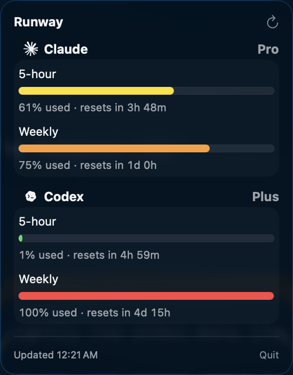
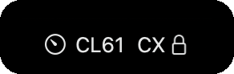

<h1 align="center">Runway</h1>

<p align="center">
  A minimal macOS menu-bar app that shows your <b>5-hour</b> and <b>weekly</b> usage
  limits for <b>Claude Code</b> and <b>Codex</b>, nothing else.<br>
  Native components, official logos, system colors only.
</p>

<p align="center">
  <sub>macOS 13+ · SwiftUI <code>MenuBarExtra</code> · menu-bar only (no Dock icon)</sub>
</p>

<p align="center">
  <a href="https://github.com/saadjs/Runway/releases"></a>
  
  
  <a href="https://github.com/saadjs/homebrew-tap"></a>
  
</p>

<p align="center">
  <br><br>
  
</p>

## What it does

- Reads the credentials the `claude` and `codex` CLIs already store, so there's
  nothing to log into.
- Shows each provider's rolling 5-hour and 7-day windows with a percentage and an
  optional reset countdown.
- The menu-bar label shows the highest current 5-hour usage at a glance.
- Refreshes on launch, on a configurable interval (default 5 min), and on demand.
- Settings (⌘,): launch at login, refresh interval (presets or a custom value),
  per-provider show/hide, and a toggle for the reset countdown.

## How usage is fetched

| Provider    | Credentials                                                                                 | Endpoint                                 |
| ----------- | ------------------------------------------------------------------------------------------- | ---------------------------------------- |
| Claude Code | login Keychain item `Claude Code-credentials` (falls back to `~/.claude/.credentials.json`) | `GET api.anthropic.com/api/oauth/usage`  |
| Codex       | `~/.codex/auth.json`                                                                        | `GET chatgpt.com/backend-api/wham/usage` |

Claude tokens are **not** refreshed by Runway (the CLI rotates them); if the
session is expired it asks you to run `claude`. Codex tokens are refreshed and
written back to `auth.json`, matching what the CLI does.

## Install

```bash
brew install --cask saadjs/tap/tokens-runway
```

A notarized, stapled build straight from [Releases](https://github.com/saadjs/Runway/releases).

## Build & run

```bash
./Scripts/build-app.sh release   # builds build/Runway.app (ad-hoc signed)
open build/Runway.app
```

For development you can also just `swift run`.

> The first launch reads the Claude Keychain item; approve **Always Allow** once.
> The build is ad-hoc signed so the grant persists across launches.

## Release process (notarized) & Homebrew

Notarization needs the Mac's signing identity, so you build and publish the
release **locally**. Publishing it then triggers a workflow that updates the
Homebrew cask automatically — you never hand-edit it.

### One-time setup

- Store the App Store Connect API key as a notarytool keychain profile named
  `runway-notary` (the cert is already in the login keychain):

  ```bash
  xcrun notarytool store-credentials runway-notary \
    --key <path-to-.p8-file> --key-id <key-id> --issuer <issuer-id>
  ```

- Repo secret `HOMEBREW_TAP` — a token with write access to `saadjs/homebrew-tap`,
  used by `.github/workflows/homebrew-tap.yml` to push the cask update.

### Cut a release

1. Bump `APP_VERSION` in `Scripts/build-app.sh`, then build the notarized zip:

   ```bash
   ./Scripts/release.sh
   ```

   It builds with the hardened runtime, Developer ID signs, notarizes, staples,
   zips the `.app`, and prints the `version`/`sha256`/`url`.

2. Publish the release (this creates the tag):

   ```bash
   gh release create v1.5 build/Runway-1.5.zip --repo saadjs/Runway --generate-notes
   ```

Publishing fires the **Publish to Homebrew tap** workflow, which downloads the
zip, recomputes its sha256, and commits the new `version`/`sha256` to
`saadjs/homebrew-tap/Casks/tokens-runway.rb`. `brew upgrade` users get it with no
further action. (Re-run for an existing tag via the workflow's `workflow_dispatch`.)

Verify before announcing:

```bash
brew update && brew fetch --cask saadjs/tap/tokens-runway   # resolves URL + checks sha256
```

## Adding another provider

The app is intentionally modular. To support a new app:

1. Add a type conforming to `UsageProvider` in `Sources/Runway/Providers/`,
   implementing `fetchUsage() -> ProviderUsage` (a `fiveHour` and `weekly`
   `UsageWindow`).
2. Drop its logo PDF in `Sources/Runway/Resources/` and reference it via
   `logoResource`.
3. Append it to `ProviderRegistry.all`.

Everything else (refresh loop, UI, menu-bar label) picks it up automatically.

## Layout

```
Sources/Runway/
  App/        RunwayApp.swift        MenuBarExtra + accessory policy
  Core/       UsageModels, UsageProvider, ProviderRegistry, Keychain
  Providers/  ClaudeProvider, CodexProvider
  Store/      UsageStore, AppSettings    refresh loop + state, preferences
  Views/      MenuView, ProviderCardView, UsageBarView, SettingsView, Support
  Resources/  claude.pdf, codex.pdf      official logos (template-tinted)
```
