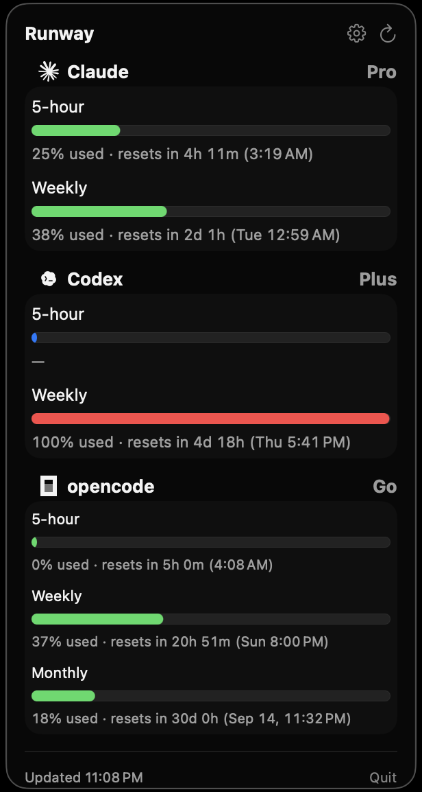
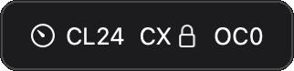

<h1 align="center">Runway</h1>

<p align="center">
  A minimal macOS menu-bar app that shows your <b>5-hour</b>, <b>weekly</b>, and <b>monthly</b> usage
  limits for <b>Claude Code</b>, <b>Codex</b>, and <b>OpenCode Go</b>, nothing else.<br>
  Native components, official logos, system colors only.
</p>

<p align="center">
  <sub>macOS 13+ · SwiftUI <code>MenuBarExtra</code> · menu-bar only (no Dock icon)</sub>
</p>

<p align="center">
  <a href="https://github.com/saadjs/Runway/releases"></a>
  
  
  <a href="https://github.com/saadjs/homebrew-tap"></a>
  
</p>

<p align="center">
  <br><br>
  
</p>

## What it does

- Reads the credentials the `claude`, `codex`, and `opencode` CLIs already store,
  so there's nothing to log into.
- Shows each provider's rolling 5-hour and 7-day windows — plus a monthly one
  where the provider has it — with a percentage and an optional reset countdown.
- The menu-bar label shows every provider's current 5-hour usage at a glance.
- Refreshes on launch, on a configurable interval (default 5 min), and on demand.
- Settings (⌘,): launch at login, refresh interval (presets or a custom value),
  per-provider show/hide, and a toggle for the reset countdown.

## How usage is fetched

| Provider    | Credentials                                                                                 | Endpoint                                 |
| ----------- | ------------------------------------------------------------------------------------------- | ---------------------------------------- |
| Claude Code | login Keychain item `Claude Code-credentials` (falls back to `~/.claude/.credentials.json`) | `GET api.anthropic.com/api/oauth/usage`  |
| Codex       | `~/.codex/auth.json`                                                                        | `GET chatgpt.com/backend-api/wham/usage` |
| OpenCode Go | `~/.local/share/opencode/auth.json` (or `OPENCODE_API_KEY`)                                 | `GET opencode.ai/zen/go/v1/usage`        |

Claude tokens are **not** refreshed by Runway (the CLI rotates them); if the
session is expired it asks you to run `claude`. Codex tokens are refreshed and
written back to `auth.json`, matching what the CLI does. OpenCode Go uses a
long-lived API key, so there is nothing to refresh.

OpenCode Go's limits are dollar caps — $12 per 5 hours, $30 weekly, $60 monthly —
so its card shows a third **Monthly** bar. Claude and Codex have no monthly cap
and keep two bars.

## Install

```bash
brew install --cask saadjs/tap/tokens-runway
```

A notarized, stapled build straight from [Releases](https://github.com/saadjs/Runway/releases).

## Build & run

```bash
./Scripts/build-app.sh release   # builds build/Runway.app (ad-hoc signed)
open build/Runway.app
```

For development you can also just `swift run`.

> The first launch reads the Claude Keychain item; approve **Always Allow** once.
> The build is ad-hoc signed so the grant persists across launches.

## Release process (notarized) & Homebrew

Bump `APP_VERSION` in `Scripts/build-app.sh`, then:

```bash
./Scripts/release.sh                                                    # signs, notarizes, staples, zips
gh release create v1.6 build/Runway-1.6.zip --repo saadjs/Runway --generate-notes
```

Publishing the release triggers `.github/workflows/homebrew-tap.yml`, which
updates the cask in `saadjs/homebrew-tap` automatically. (Needs the `HOMEBREW_TAP`
repo secret, and a local `runway-notary` notarytool keychain profile for signing.)

## Adding another provider

The app is intentionally modular. To support a new app:

1. Add a type conforming to `UsageProvider` in `Sources/Runway/Providers/`,
   implementing `fetchUsage() -> ProviderUsage` (a `fiveHour` and `weekly`
   `UsageWindow`).
2. Drop its logo PDF in `Sources/Runway/Resources/` and reference it via
   `logoResource`.
3. Append it to `ProviderRegistry.all`.

Everything else (refresh loop, UI, menu-bar label) picks it up automatically.

## Layout

```
Sources/Runway/
  App/        RunwayApp.swift        MenuBarExtra + accessory policy
  Core/       UsageModels, UsageProvider, ProviderRegistry, Keychain
  Providers/  ClaudeProvider, CodexProvider, OpenCodeProvider
  Store/      UsageStore, AppSettings    refresh loop + state, preferences
  Views/      MenuView, ProviderCardView, UsageBarView, SettingsView, Support
  Resources/  claude.pdf, codex.pdf, opencode.pdf   official logos (template-tinted)
```
